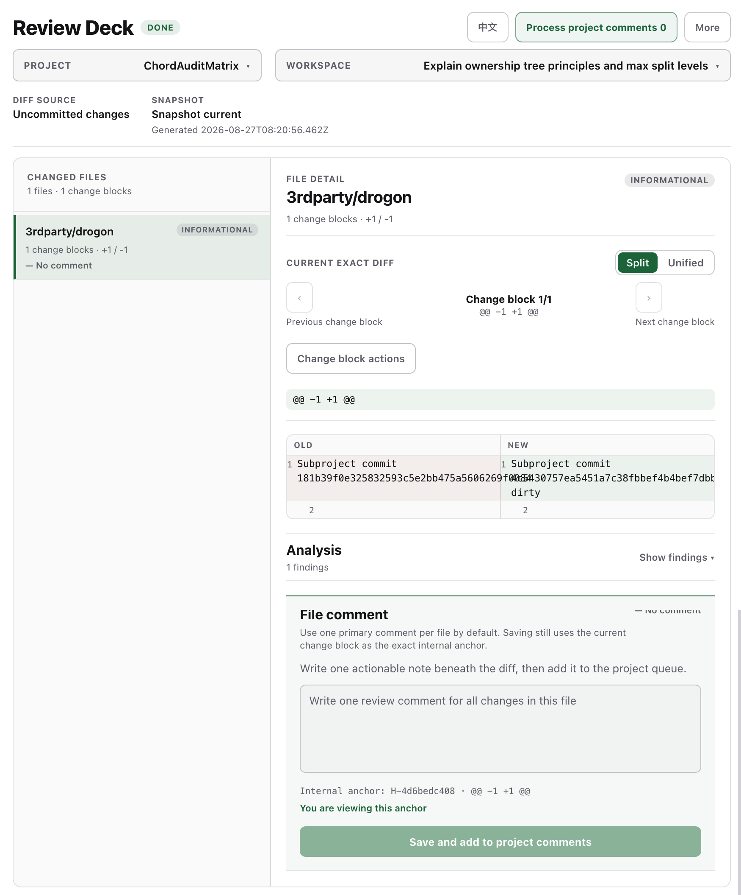
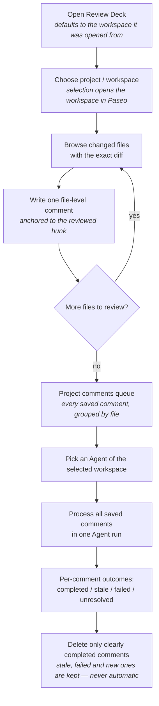

# Review Deck

A **human-in-the-loop review plugin for Paseo**. When an Agent finishes a change in a Paseo workspace (worktree), reviewing the result across many files is awkward — you have to keep viewing diffs, annotate them, feed your feedback back to an Agent, and clean up afterwards. Review Deck turns a Git changeset into a **navigable review workspace**: browse files and hunks, leave comments right next to the exact diff, collect them in a project queue, and let one Agent process all of them at once.



## The problem

After an Agent works in a Paseo workspace, the changes are spread across many files, hunks, and commits. A careful human review means:

- **Seeing** what changed — file by file, hunk by hunk
- **Annotating** the exact diff with notes and decisions
- **Feeding back** those comments to an Agent that can act on them
- **Cleaning up** once the feedback has been handled

Review Deck turns the Git diff into a navigable human-in-the-loop review workspace. It never treats AI output as a substitute for your final decision — AI findings are clearly labeled as inference, and verified facts are presented separately.

## Main capabilities

| Capability | What it does |
|---|---|
| File-first review UI | Navigate changed files and hunks with the exact diff shown next to the change details; wide layout shows file list and file details side by side, compact layout drills down |
| Inline comments | Write a file-level main comment beside the change details and save it; the comment stays anchored to the change you reviewed |
| Project comments queue | The top queue aggregates every saved comment for the current project, grouped by workspace, scope, and file |
| AI processing | Select the Agent of the current workspace and process all saved comments for the project in one batch |
| AI review & explain | Explain a hunk with local rules or ask an Agent for an AI explanation; run a full review of the changeset with an Agent; results separate verified facts from AI inference |
| Scope | Review the working tree, staged changes, a branch, or specific commits |
| Safe hunk rejection | Reject a hunk by reversing its patch — only when the workspace still matches the reviewed snapshot, so unrelated work is never overwritten |
| Bilingual UI | English and 中文 (Chinese) |



## Usage

1. **Open the panel.** From the Command Center (⌘K / Ctrl+K), run **Open Review Deck**. The panel opens on the workspace you started from and defaults to it.
2. **Pick a project and workspace.** Use the pickers at the top of the panel. Selecting a project or workspace brings that workspace to the Paseo foreground.
3. **Browse the changes.** Work through the changed files; each file shows its hunks with the exact diff next to the change details.
4. **Leave a comment.** Write a file-level main comment beside the change details and save it.
5. **Watch the queue.** The project comments queue at the top summarizes all saved comments for the current project.
6. **Process with an Agent.** Select an Agent from the current workspace and process all saved comments for the project in one batch.
7. **Clean up.** After processing, delete the comments that were clearly marked as completed. Failed, stale, or unresolved comments are kept.

## Safety & limitations

- **No automatic deletion.** Comments are never deleted automatically. Only comments an Agent explicitly marked as completed (while idle) can be cleared — failed, stale, and unresolved comments are always kept.
- **Fingerprint-checked Git operations.** Hunk rejection applies a reverse patch only after verifying that the workspace and index still match the reviewed snapshot. If anything changed, the operation is safely refused and the analysis is marked stale.
- **Batch processing is delegated.** Project batch processing is executed by the selected workspace Agent, so outcomes depend on that Agent; AI explanations and reviews are labeled with the provider/model that produced them.
- **Commit scopes are read-only.** Branch and commit scopes support commenting and feedback, but hunk rejection is available only for working-tree and staged changes.
- **An Agent is required.** AI review and feedback need an available Agent in the current workspace; without one, deterministic analysis and manual review still work.

## Quick start

From the repository root:

```sh
npm install        # install dependencies
npm run typecheck  # type check
```

Install and manage the plugin with the Paseo CLI:

```sh
paseo plugin install /path/to/review-deck  # install from this repo
paseo plugin reload review-deck            # reload after source edits
paseo plugin ls                            # verify the plugin is running
```

Open the panel from the Command Center (**⌘K** on macOS, **Ctrl+K** on Windows/Linux) with **Open Review Deck**.

The plugin depends on an existing Paseo workspace and Agent. No additional model configuration is required — models are configured in the Paseo Agent settings, and Review Deck uses the model of the Agent you select.

## Acknowledge

Review Deck relies on the Paseo Plugin API and is designed to complement the Paseo workspace and agent workflow. Thanks to the Paseo team for the plugin system, workspace, and agent model that make human-in-the-loop review possible.
