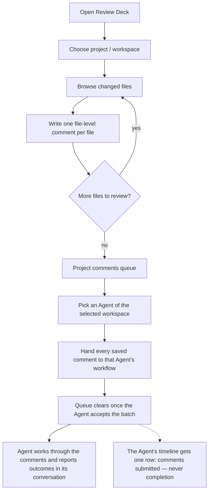
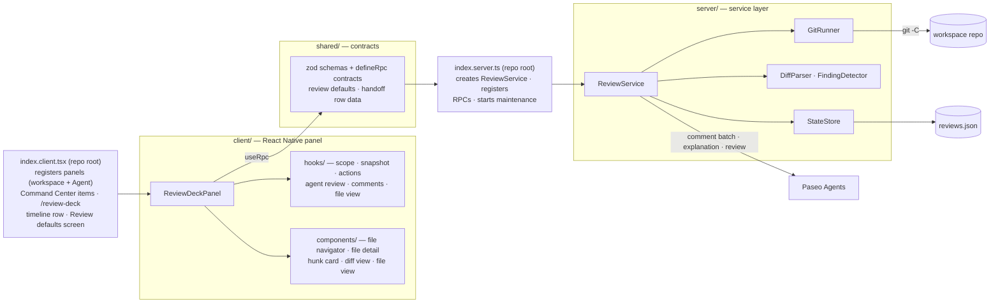

# Review Deck

A **human-in-the-loop review plugin for Paseo**. When an Agent finishes a change in a Paseo workspace (worktree), reviewing the result across many files is awkward — you have to keep viewing diffs, annotate them, feed your feedback back to an Agent, and clean up afterwards. Review Deck turns a Git changeset into a **navigable review workspace**: browse files and hunks, leave comments right next to the exact diff, collect them in a project queue, and let one Agent process all of them at once.


## The problem

After an Agent works in a Paseo workspace, the changes are spread across many files, hunks, and commits. A careful human review means:

- **Seeing** what changed — file by file, hunk by hunk
- **Annotating** the exact diff with notes and decisions
- **Feeding back** those comments to an Agent that can act on them
- **Cleaning up** once the feedback has been handled

Review Deck turns the Git diff into a navigable human-in-the-loop review workspace. It never treats AI output as a substitute for your final decision — AI findings are clearly labeled as inference, and verified facts are presented separately.

## Main capabilities

| Capability | What it does |
|---|---|
| File-first review UI | Navigate changed files and hunks with the exact diff shown next to the change details; wide layout shows file list and file details side by side, compact layout drills down |
| Inline comments | Write a file-level main comment beside the change details and save it; the comment stays anchored to the change you reviewed |
| Project comments queue | The top queue aggregates every saved comment for the current project, grouped by workspace, scope, and file |
| AI processing | Select the Agent of the current workspace and process all saved comments for the project in one batch |
| Agent-context Review Deck | Open Review Deck bound to the Agent of the current workspace — its own panel entry, the Command Center item **Open Review Deck for this Agent**, or the **`/review-deck`** slash command in an Agent chat; the Agent is preselected as the review target |
| Submission timeline row | Handing a comment batch to an Agent adds one row to that Agent's timeline — *"{count} review comments submitted"*. The row records only the submission: it never claims completion and never carries comment, patch, path, or identifier content |
| Review defaults | Panel language (Auto / 中文 / English) and default diff layout (Auto / Unified / Split), configured under **Settings → Plugins → Review defaults** and stored per host |
| AI review & explain | Explain a hunk with local rules or ask an Agent for an AI explanation; run a full review of the changeset with an Agent; results separate verified facts from AI inference |
| Scope | Review the working tree, staged changes, a branch, or specific commits |
| Safe hunk rejection | Reject a hunk by reversing its patch — only when the workspace still matches the reviewed snapshot, so unrelated work is never overwritten |
| File-level actions | Mark a whole file reviewed in one tap, ask an Agent to explain a whole file, or revert all of a file's changes at once — comment-anchored hunks are skipped automatically |
| Bilingual UI | English and 中文 (Chinese) |



## Architecture

Review Deck is a Paseo **0.8.x** plugin built on the v0.8 runtime-entry format: two root entries — `index.client.tsx` (client runtime) and `index.server.ts` (server runtime) — separate from the React Native panel, the typed RPC contract file, and the server-side service layer. All review state lives on disk in `~/.paseo/review-deck/reviews.json`; Git access is centralized behind one runner with fingerprint-checked safety.



- **index.client.tsx** is the v0.8 client runtime entry — it registers both Review Deck panels (the workspace panel and the Agent-context panel that preselects the current Agent), the **Open Review Deck** and **Open Review Deck for this Agent** Command Center items, the **`/review-deck`** slash command, the timeline renderer for the submission row, and the **Review defaults** settings screen with the Paseo client runtime.
- **index.server.ts** is the v0.8 server runtime entry — it constructs the `ReviewService`, registers the RPC handlers from the shared contract, and starts the maintenance sweep; its returned cleanup stops maintenance on unload.
- **client/** owns presentation and intent only — every mutation goes through an RPC.
- **shared/review.ts** is the single source of truth for request/response shapes (zod), imported by both sides.
- **shared/review-settings.ts** defines the host-scoped v1 Review Deck defaults — panel locale (`auto`/`zh`/`en`) and default diff layout (`auto`/`unified`/`split`). Only harmless display preferences are settings; agent identity, scopes, paths, comments, and review state are never persisted there.
- **shared/review-handoff.ts** defines the version-1 `review-deck-handoff` timeline row: exactly a positive comment count and the ISO submission timestamp, parsed strictly so a row can never carry review content, patch text, file paths, or workspace/project/agent identifiers.
- **server/** composes small, injectable classes: `GitRunner` wraps all git invocations with output limits, `StateStore` owns atomic JSON persistence, `ReviewService` orchestrates snapshots, decisions, file-level actions, and Agent delegation.

Requires **Paseo 0.8.x** (`>=0.8.0 <0.9.0`).

## Usage

1. **Open the panel.** From the Command Center (⌘K / Ctrl+K), run **Open Review Deck**. The panel opens on the workspace you started from and defaults to it. From inside an Agent, use **Open Review Deck for this Agent** or type **`/review-deck`** to open the deck bound to that Agent — it is preselected as the review target.
2. **Pick a project and workspace.** Use the pickers at the top of the panel. Selecting a project or workspace brings that workspace to the Paseo foreground.
3. **Browse the changes.** Work through the changed files; each file shows its hunks with the exact diff next to the change details.
4. **Leave a comment.** Write a file-level main comment beside the change details and save it.
5. **Watch the queue.** The project comments queue at the top summarizes all saved comments for the current project.
6. **Process with an Agent.** Select an Agent from the current workspace and process all saved comments for the project in one batch. The batch is handed to that Agent's workflow and the queue clears at handoff — Review Deck never waits for the Agent and never tracks completion.
7. **Read the results in the Agent's conversation.** The Agent works through the comments and reports per-comment outcomes (completed / stale / failed / unresolved) in its own reply; its timeline also shows one *"{count} review comments submitted"* row as the handoff record. Re-add any comment the Agent could not complete if you want it revisited.
8. **Tune the defaults.** Under **Settings → Plugins → Review defaults**, choose the panel language (Auto / 中文 / English) and the default diff layout (Auto / Unified / Split); these host-scoped settings apply everywhere Review Deck opens.

## Limitations

- **Comments leave the deck at handoff, not at completion.** Processing a project hands every saved comment to the selected Agent's workflow fire-and-forget; once the Agent accepts the batch, those comments are removed from the queue (reviewed records are kept). Review Deck never tracks whether the Agent's work completed — the Agent reports per-comment outcomes in its own conversation, and you re-add anything it could not finish.
- **The timeline row records only the submission.** The *"{count} review comments submitted"* row on the Agent's timeline is an audit record of the handoff, not a completion tracker: it never claims the work finished and carries no comment or patch content, file paths, or identifiers.
- **Batch processing is delegated.** Project batch processing is executed by the selected workspace Agent, so outcomes depend on that Agent; AI explanations and reviews are labeled with the provider/model that produced them.
- **Commit scopes are read-only.** Branch and commit scopes support commenting and feedback, but hunk rejection is available only for working-tree and staged changes.
- **An Agent is required.** AI review and feedback need an available Agent in the current workspace; without one, deterministic analysis and manual review still work.

## Safety controls

- **Fingerprint-checked Git operations.** Hunk rejection applies a reverse patch only after verifying that the workspace and index still match the reviewed snapshot. If anything changed, the operation is safely refused and the analysis is marked stale.

## Installation

Review Deck requires Paseo 0.8.x (currently beta) and is incompatible with Paseo 0.7.x.

Install it from GitHub:

```sh
paseo plugin add mentalfl0w/review-deck
paseo plugin ls
```

Open the panel from the Command Center (**⌘K** on macOS, **Ctrl+K** on Windows/Linux) with **Open Review Deck** — or, from inside an Agent, use **Open Review Deck for this Agent** or the **`/review-deck`** slash command for the Agent-bound deck.

The plugin depends on an existing Paseo workspace and Agent. No additional model configuration is required — models are configured in the Paseo Agent settings, and Review Deck uses the model of the Agent you select.

## Development

From the repository root:

```sh
npm install
npm run typecheck
npm test
```

Install and manage a local checkout with the Paseo CLI:

```sh
paseo plugin install /absolute/path/to/review-deck
paseo plugin reload review-deck
paseo plugin ls
```

## Acknowledge

Review Deck relies on the Paseo Plugin API and is designed to complement the Paseo workspace and agent workflow. Thanks to the Paseo team for the plugin system, workspace, and agent model that make human-in-the-loop review possible.
