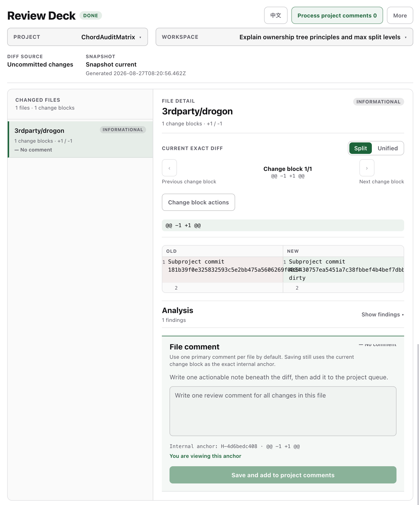
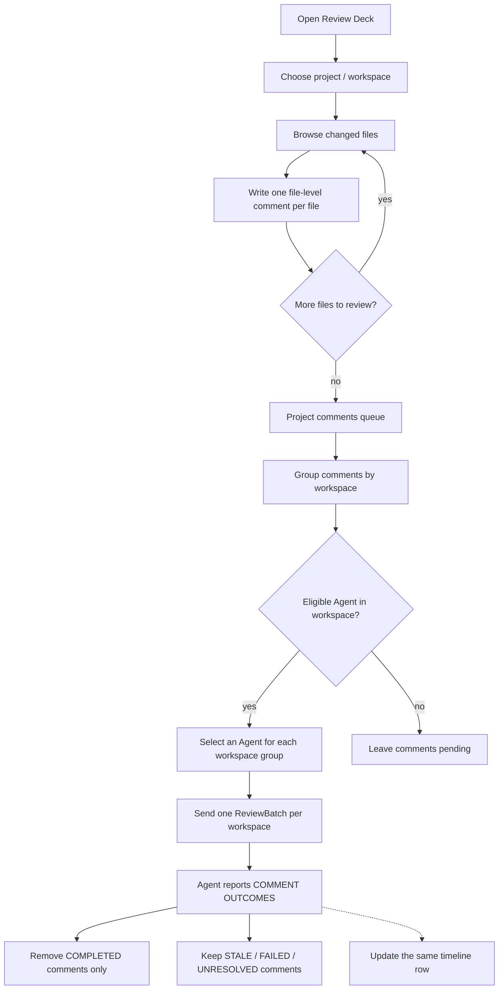
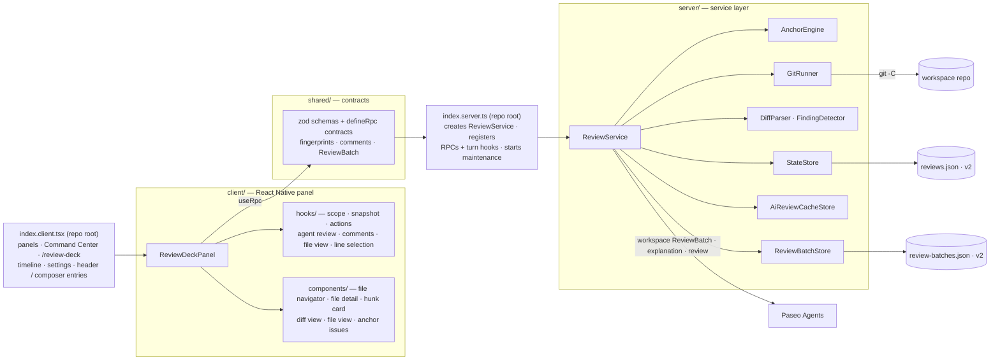

# Review Deck

A **human-in-the-loop review plugin for Paseo**. When an Agent finishes a change in a Paseo workspace (worktree), reviewing the result across many files is awkward — you have to keep viewing diffs, annotate them, feed your feedback back to an Agent, and clean up afterwards. Review Deck turns a Git changeset into a **navigable review workspace**: browse files and hunks, leave comments right next to the exact diff, collect them in a project queue, and route each workspace's comments to an Agent in that same workspace.



## The problem

After an Agent works in a Paseo workspace, the changes are spread across many files, hunks, and commits. A careful human review means:

- **Seeing** what changed — file by file, hunk by hunk
- **Annotating** the exact diff with notes and decisions
- **Feeding back** those comments to an Agent that can act on them
- **Cleaning up** once the feedback has been handled

Review Deck turns the Git diff into a navigable human-in-the-loop review workspace. It never treats AI output as a substitute for your final decision — AI findings are clearly labeled as inference, and verified facts are presented separately.

## Main capabilities

| Capability | What it does |
|---|---|
| File-first review UI | Navigate changed files and hunks with the exact diff shown next to the change details; wide layout shows file list and file details side by side, compact layout drills down |
| Inline comments | Select exact diff lines (click / Shift-click on desktop, two taps in compact layouts) or keep a hunk-level anchor; comments follow safe re-anchors across snapshots |
| Project comments queue | The top queue aggregates every saved comment for the current project, grouped by workspace, scope, and file |
| AI processing | Group project comments by workspace and submit each group to an Agent in that workspace. Only explicit `COMPLETED` outcomes remove comments; stale, failed, and unresolved comments stay queued |
| Agent-targeted Review Deck | Open Review Deck from an Agent's Command Center item, `/review-deck`, or Composer Pill; the Agent is preselected, and all of these open the same workspace-scoped tab |
| Paseo-native entries | Workspace Header badges prioritize actionable pending comments, then stale/ambiguous comments, then unread AI findings; the native popover shows review progress, queue state, active reviews, and Deck/Queue actions. Agent Composer Pill menus open the Deck or Queue in that same workspace tab, review current changes with AI, or submit that workspace's comments; run/submit actions are gated by workspace, Agent, diff, and batch state. |
| Review timelines | `review-deck-batch` rows update by stable id from submitted/running to completed/partial/failed. AI-review rows summarize completion, finding/high-risk counts, and token usage. Both contain status metadata only — never findings, comment text/IDs, file paths, patches, or cwd. |
| Review defaults | Interface language (Auto follows the browser/device preferred language; selecting 中文 or English localizes the settings form, Header status popover, and Pill action labels), diff layout (Auto / Unified / Split), reviewer strategy and Provider / Model / Thinking, cache, token-usage display, and the default Economical / Balanced / Deep preset. Settings are host-scoped under **Settings → Plugins → Review Deck** |
| AI review & explain | Explain a hunk, review one file, or review the current target. The preset sets risk coverage and default depth; Targeted / Full can override patch context per run. Reviewers use Read-only/Plan where available; Codex falls back to provider options that force a read-only sandbox and on-request approvals. Providers with no documented safe mode (the current Pi catalog exposes none) fail closed. Codex/OpenCode receive Paseo `outputSchema`; other providers use Markdown fallback. Structured findings may include executable + argv verification suggestions; free-form `suggestedCheck` text is never executed. |
| Verification Terminal | A structured finding can offer a concrete executable and argv. Review Deck shows the exact command, requires confirmation, and opens an interactive terminal in the current workspace. v2.0 displays terminal output but does not infer pass/fail or create `verified_fact`; automated exit-status evidence is deferred to v2.1. If the target or workspace changes while restoring run history, old runs are omitted and the snapshot is marked stale. Workspace-activity probes are coalesced to prevent update bursts from launching duplicate full snapshots. |
| Browser Preview | Configure an HTTP(S) preview URL per project and Host in **More**. **Open Preview** uses Paseo's workspace browser where `navigation.openBrowser` is available; it never falls back to an external browser. |
| Scope | Review the working tree, staged changes, a branch, or specific commits |
| Safe hunk rejection | Reject a hunk by reversing its patch — only when the workspace still matches the reviewed snapshot, so unrelated work is never overwritten |
| File-level actions | Mark a whole file reviewed in one tap, ask an Agent to explain a whole file, or revert all of a file's changes at once — comment-anchored hunks are skipped automatically |
| Bilingual UI | English and 中文 (Chinese) |


```mermaid
flowchart TB
    A[Open Review Deck] --> B[Choose project / workspace]
    B --> C[Browse changed files]
    C --> D[Write one file-level comment per file]
    D --> E{More files to review?}
    E -- yes --> C
    E -- no --> F[Project comments queue]
    F --> G[Group comments by workspace]
    G --> H{Eligible Agent in workspace?}
    H -- yes --> I[Select an Agent for each workspace group]
    H -- no --> J[Leave comments pending]
    I --> K[Send one ReviewBatch per workspace]
    K --> L[Agent reports COMMENT OUTCOMES]
    L --> M[Remove COMPLETED comments only]
    L --> N[Keep STALE / FAILED / UNRESOLVED comments]
    L -.-> O[Update the same timeline row]
```

## Architecture

Review Deck is a Paseo **0.10.0+** plugin using the v0.8 runtime-entry format: two root entries — `index.client.tsx` (client runtime) and `index.server.ts` (server runtime) — separate from the React Native panel, typed RPC contracts, and server-side service layer. Review state lives in a versioned v2 envelope at `~/.paseo/review-deck/reviews.json`; ReviewBatch state uses a separate strict v2 envelope at `~/.paseo/review-deck/review-batches.json`. A valid v1 ReviewBatch store migrates on first read only after its exact bytes are preserved in a non-overwritable read-only `.v1.bak` file; malformed data or a conflicting backup fails closed. Transient AI Review run metadata uses a strict v1 store at `~/.paseo/review-deck/runs.json`; AI review results use a separate bounded cache at `~/.paseo/review-deck/ai-review-cache.json` (30-day TTL, 256-entry cap). Run metadata never stores prompts, patches, or review text. Git access is centralized behind one runner with fingerprint-checked safety.


```mermaid
flowchart LR
    subgraph panel["client/ — React Native panel"]
        Panel["ReviewDeckPanel"]
        Hooks["hooks/ — scope · snapshot · actions<br/>agent review · comments · file view · line selection"]
        UI["components/ — file navigator · file detail · hunk card<br/>diff view · file view · anchor issues"]
        Panel --> Hooks
        Panel --> UI
    end

    subgraph shared["shared/ — contracts"]
        RPC["zod schemas + defineRpc contracts<br/>fingerprints · comments · ReviewBatch"]
    end

    subgraph server["server/ — service layer"]
        Svc["ReviewService"]
        Anchor["AnchorEngine"]
        Git["GitRunner"]
        Parse["DiffParser · FindingDetector"]
        Store["StateStore"]
        AiCache["AiReviewCacheStore"]
        BatchStore["ReviewBatchStore"]
        Svc --> Anchor
        Svc --> Git
        Svc --> Parse
        Svc --> Store
        Svc --> AiCache
        Svc --> BatchStore
    end

    ClientEntry["index.client.tsx (repo root)<br/>panels · Command Center · /review-deck<br/>timeline · settings · header / composer entries"]
    ServerEntry["index.server.ts (repo root)<br/>creates ReviewService · registers<br/>RPCs + turn hooks · starts maintenance"]
    Agents["Paseo Agents"]
    Repo[("workspace repo")]
    State[("reviews.json · v2")]
    Batches[("review-batches.json · v2")]

    BatchStore --> Batches
    ClientEntry --> Panel
    Panel -- "useRpc" --> RPC
    RPC --> ServerEntry
    ServerEntry --> Svc
    Git -- "git -C <cwd>" --> Repo
    Store --> State
    Svc -- "workspace ReviewBatch · explanation · review" --> Agents
```


- **index.client.tsx** is the Paseo 0.10 client runtime entry — it registers one workspace-scoped Review Deck tab, Command Center items, `/review-deck`, handoff / batch / AI-review timeline renderers, Review defaults, a workspace status popover, and subscription-backed Agent composer menus. Header, Agent, Queue, targeted-review, and timeline entry points reuse that tab.
- **index.server.ts** is the Paseo 0.10 server runtime entry — it retains the settings handle, constructs `ReviewService`, registers RPC and `agent.turn_started` / `agent.turn_ended` lifecycle handlers, and starts maintenance; cleanup removes both hooks and stops maintenance.
- **client/** owns presentation and intent only — every mutation goes through an RPC.
- **shared/review.ts** is the single source of truth for review RPC request/response shapes (zod), imported by both sides.
- **shared/review-batch.ts** defines ReviewBatch state and the strict `review-deck-batch` v1 timeline payload. The stable timeline item id replaces one row as status changes; the data includes only workspace ID, status, outcome counts, and timestamps.
- **shared/review-handoff.ts** retains the version-1 `review-deck-handoff` renderer for older timeline rows; its content-minimal payload records only a positive comment count and ISO submission timestamp.
- **shared/review-activity.ts** defines metadata-only workspace indicators, the on-demand working-tree summary, per-workspace read marking, and the strict `review-deck-ai-review` timeline payload. Badge refresh never parses Git; detailed block counts load only when the Header Popover opens.
- **`server/`** composes small, injectable classes: `GitRunner` wraps Git invocations with output limits and pins parsed diff headers to canonical `a/` and `b/` prefixes; `StateStore` validates and atomically migrates the v2 review envelope; `ReviewBatchStore` persists batch transitions in a strict versioned envelope; `DiffParser` provides the shared single-hunk body parser; `AnchorEngine` resolves anchors without auto-selecting ambiguity; and `ReviewService` orchestrates Git review and Agent batches.
- **Verification Terminal** opens an interactive workspace terminal after explicit confirmation. The user inspects output in Paseo; Review Deck does not infer command success or persist terminal output in v2.0.

- **Agent updates are event-driven.** One owned agent subscription feeds the panel registry and composer pills; workspace activity and agent updates trigger fingerprint-only snapshot checks, with a 60-second fallback.
- **Damaged review state fails closed.** Legacy files migrate automatically; invalid JSON or schema data surfaces an error and is never replaced with an empty store.

Requires **Paseo 0.10.0 or newer** (`>=0.10.0`).

## Usage

1. **Open the panel.** In a workspace Header, the **Review** button may be icon-only or inside the compact-layout overflow menu. A live Agent's Composer shows a **Review** Pill beside Tasks/Subagents. The Command Center and `/review-deck` also open it. These entry points reuse one Review Deck tab per workspace.
2. **Pick a project and workspace.** Use the pickers at the top of the panel. Selecting a project or workspace brings that workspace to the Paseo foreground.
3. **Browse and select the change.** Work through the changed files; each file shows its hunks with the exact diff next to the change details. Click a line number to select it; Shift-click extends a range on desktop, while compact layouts use two taps.
4. **Leave a comment.** Save a comment against the selected line range, or leave the selection empty to keep the hunk-level anchor.
5. **Watch the queue.** The project comments queue at the top summarizes all saved comments for the current project.
6. **Submit workspace batches.** The queue groups comments by workspace. An Agent-launched Review Deck preselects that Agent; otherwise one freshly verified idle Agent bound to the exact workspace is selected. Running or initializing Agents remain visible but cannot receive comment batches. Workspaces without an eligible Agent stay queued.
7. **Track outcomes and delivery.** Comments remain queued until the matching Agent turn reports explicit `COMPLETED` outcomes. Each send has a stable message id; an ambiguous send remains claimed and is never retried automatically. A confirmed duplicate-risk action can release a stranded claim for a user-confirmed retry.
8. **Tune the defaults.** Under **Settings → Plugins → Review defaults**, choose the panel language (Auto / 中文 / English) and the default diff layout (Auto / Unified / Split); these host-scoped settings apply everywhere Review Deck opens.
9. **Run a verification command.** Review the structured executable and arguments, then confirm. Review Deck opens an interactive terminal in the current workspace; inspect its output in Paseo. v2.0 does not mark pass/fail automatically.
10. **Preview the project.** On Electron, open **More → Browser Preview**, set the project's HTTP(S) URL, then choose **Open Preview**. The URL is saved per project on the current Host.

## Limitations

- **Unfinished comments remain queued.** Only an explicit `COMPLETED` outcome from the matching Batch turn clears a comment; missing, malformed, duplicate, conflicting, stale, ambiguous, or mismatched-turn outcomes remain pending. Review Deck persists a send intent and stable message id before dispatch. A successful `send()` acknowledgment or exact timeline message proves delivery, not completion. The SDK exposes no stable rejection discriminator, so every `send()` failure is conservatively treated as unknown and never retried automatically. Timeline evidence can recover delivery; `unknown` or `accepted` batches without a proven Turn retain their claims across restarts. Active v1 batches without delivery identity are never auto-linked, failed, or released by Turn/Archive events; explicit release is required and may duplicate work. Only a prepared batch with no persisted send attempt gets a two-minute grace, released after a successful refresh shows the Agent is not running or initializing. A proven Turn can be released as unresolved after it stops; Archive events resolve only new batches whose delivery state proves they are not in flight. Status/timeline lookup failure or a null Agent snapshot keeps the claim. The Agent's claim is not independent verification, so review the resulting diff before accepting it.
- **AI Review recovery is bounded.** After reload, a running review resumes only when its labeled child still matches the stored parent/workspace and is not archived. Runs past the one-hour metadata TTL, missing children, archived children, or prompt/schema-version mismatches are abandoned. The UI's active poll loop has a separate five-minute wait cap. `runs.json` stores metadata only; review content stays in the Agent timeline or optional cache.
- **Workspace routing is fail-closed.** A batch is bound to one workspace and one Agent in that workspace. Legacy comments without `workspaceId` are assigned only when a complete project workspace list proves their cwd has exactly one owner; ambiguous or unavailable ownership leaves them unassigned. If no eligible Agent exists, Review Deck keeps comments queued and never creates an Agent automatically.
- **Timeline rows are status records, not review content.** Batch rows update by stable id; AI-review rows report status, finding/high-risk counts, and usage. Neither timeline payload includes comment ids, text, paths, cwd, patches, or full findings.
- **Commit scopes are read-only.** Branch and commit scopes support commenting and feedback, but hunk rejection is available only for working-tree and staged changes.
- **Agent availability depends on workspace.** Project batches need an eligible Agent in each target workspace; AI review and explain still use an Agent in the current workspace. Without a batch Agent, comments stay queued, while deterministic analysis and manual review remain available.
- **Notifications are in-app only.** v1.7 uses Header/Pill badges, popovers, and Agent timeline summaries; Paseo exposes no generic plugin-generated OS push-notification API.
- **Unread AI findings follow the one-hour run TTL.** Completed file/target finding counts stay unread across reloads until Review Deck opens for that workspace or the transient ReviewRun metadata expires. Opening Review Deck through the Queue action does not mark findings read.
- **Verification commands require structured output and confirmation.** A prose `suggestedCheck` has no Run action. Commands run in a workspace-owned terminal; output stays in Paseo, and v2.0 does not create `verified_fact` from a command. Automatic exit-status evidence is deferred to v2.1.
- **Browser Preview requires Electron.** The URL is host-scoped per project. Other clients hide the action; there is no external-browser fallback.
- **One Review Deck tab per workspace.** Header, Agent, Queue, targeted-review, and timeline actions reuse one workspace panel. Tabs persisted under old Agent, Queue, or targeted-review panel IDs may remain unavailable after updating; close them once manually. Paseo exposes no plugin API to close restored panel tabs.
- **Cross-host Review Inbox is deferred to v2.1.** The current Paseo SDK cannot invoke Review Deck's plugin RPC on another Host, so v2.0 does not aggregate cross-host comment status.

## Safety controls

- **Fingerprint-checked Git operations.** Hunk rejection applies a reverse patch only after verifying that the workspace and index still match the reviewed snapshot. If anything changed, the operation is safely refused and the analysis is marked stale.
- **Re-anchoring and batch preflight are fail-closed.** Unique exact/content/context matches may follow comments; stale or ambiguous anchors are never guessed. Before submission, Review Deck snapshots the current target and resolves every selected comment through the AnchorEngine; a changed selection, stale/ambiguous anchor, or workspace identity fails the whole batch. Unique relocations update only the prompt payload. The Agent must still verify the current fingerprint before editing because Git can change after preflight. Reject/revert independently verify current target and hunk fingerprints.
- **ReviewBatch downgrade safety.** The v2 store preserves a v1 backup at `~/.paseo/review-deck/review-batches.json.v1.bak`. Stop the plugin before restoring this backup over `review-batches.json` to downgrade; do not copy a v1 backup over a store that has since accepted new batches.

## Installation

Review Deck requires Paseo 0.10.0 or newer (`>=0.10.0`).

Install it from GitHub:

```sh
paseo plugin add mentalfl0w/review-deck
paseo plugin ls
```

Open the panel from the Command Center (**⌘K** on macOS, **Ctrl+K** on Windows/Linux) with **Open Review Deck** — or, from inside an Agent, use **Open Review Deck for this Agent** or the **`/review-deck`** slash command for the Agent-bound deck.

The plugin depends on an existing Paseo workspace and Agent. No additional model configuration is required — models are configured in the Paseo Agent settings, and Review Deck uses the model of the Agent you select.

## Development

From the repository root:

```sh
npm install
npm run typecheck
npm test
```

Install and manage a local checkout with the Paseo CLI:

```sh
paseo plugin install /absolute/path/to/review-deck
paseo plugin reload review-deck
paseo plugin ls
```
Git-based installs compile client source in a fresh checkout, without the development dependencies installed by the commands above. Client code should use Paseo-provided types from `@getpaseo/plugin/client`; direct type imports from `@getpaseo/client` or `@getpaseo/protocol` may not resolve during installation.

## Acknowledge

Review Deck relies on the Paseo Plugin API and is designed to complement the Paseo workspace and agent workflow. Thanks to the Paseo team for the plugin system, workspace, and agent model that make human-in-the-loop review possible.
